---
## Front matter
title: "Отчёт по лабораторной работе №2"
subtitle: "Дисциплина: Архитектура компьютера"
author: "Бражко Александра Александровна"

## Generic otions
lang: ru-RU
toc-title: "Содержание"

## Bibliography
bibliography: bib/cite.bib
csl: pandoc/csl/gost-r-7-0-5-2008-numeric.csl

## Pdf output format
toc: true # Table of contents
toc-depth: 2
lof: true # List of figures
lot: true # List of tables
fontsize: 12pt
linestretch: 1.5
papersize: a4
documentclass: scrreprt
## I18n polyglossia
polyglossia-lang:
  name: russian
  options:
	- spelling=modern
	- babelshorthands=true
polyglossia-otherlangs:
  name: english
## I18n babel
babel-lang: russian
babel-otherlangs: english
## Fonts
mainfont: IBM Plex Serif
romanfont: IBM Plex Serif
sansfont: IBM Plex Sans
monofont: IBM Plex Mono
mathfont: STIX Two Math
mainfontoptions: Ligatures=Common,Ligatures=TeX,Scale=0.94
romanfontoptions: Ligatures=Common,Ligatures=TeX,Scale=0.94
sansfontoptions: Ligatures=Common,Ligatures=TeX,Scale=MatchLowercase,Scale=0.94
monofontoptions: Scale=MatchLowercase,Scale=0.94,FakeStretch=0.9
mathfontoptions:
## Biblatex
biblatex: true
biblio-style: "gost-numeric"
biblatexoptions:
  - parentracker=true
  - backend=biber
  - hyperref=auto
  - language=auto
  - autolang=other*
  - citestyle=gost-numeric
## Pandoc-crossref LaTeX customization
figureTitle: "Рис."
tableTitle: "Таблица"
listingTitle: "Листинг"
lofTitle: "Список иллюстраций"
lotTitle: "Список таблиц"
lolTitle: "Листинги"
## Misc options
indent: true
header-includes:
  - \usepackage{indentfirst}
  - \usepackage{float} # keep figures where there are in the text
  - \floatplacement{figure}{H} # keep figures where there are in the text
---

# Цель работы

Цель работы - изучить идеологию и применение средств контроля
версий. Приобрести практические навыки по работе с системой git.

# Задание

1. Техническое обеспечение:
	1) Настройка github.
	2) Базовая настройка git.
	3) Создания SSH ключа.
	4) Создание рабочего пространства и репозитория курса на основе
шаблона.
	5) Создание репозитория курса на основе шаблона.
	6) Настройка каталога курса.
2. Задание для самостоятельной работы.
В ходе выполнения лабораторной работы предстоит создать отчёт в
соответствующем каталоге рабочего пространства (labs>lab02>report),
скопировать отчеты по выполнению предыдущих лабораторных работ в
соответствующие каталоги и загрузить все файлы на GitHub.

# Теоретическое введение

Здесь описываются теоретические аспекты, связанные с выполнением работы.

Например, в табл. [-@tbl:std-dir] приведено краткое описание основных команд в git.

: Таблица основные команды git {#tbl:std-dir}

| Команда |Описание                                                                                                         |
|--------------|----------------------------------------------------------------------------------------------------------------------------|
| `git init`          |создание основного дерева репозитория                                                                               |
| `git pull`      | получение обновлений (изменений) текущего дерева из
центрального репозитория     |
| `git push`       | отправка всех произведённых изменений локального
дерева в центральный репозиторий                                           |
| `git status`      | просмотр списка изменённых файлов в текущей
директории |
| `git diff`     | просмотр текущих изменения носителей                                                                                   |
| `git add .`      | добавить все изменённые и/или созданные файлы и/или каталоги |
|`root`       |                                                                            |
| `/tmp`       | Временные файлы                                                                                                            |
| `/usr`       | Вторичная иерархия для данных пользователя                                                                                 |

# Выполнение лабораторной работы

Для начала создадим учётную запись на сайте https://github.com/ и
заполните основные данные (рис. [-@fig:001]).
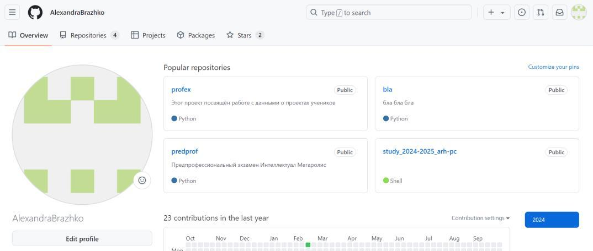{#fig:001 width=70%}

Сначала сделаем предварительную конфигурацию git, указав имя и
email владельца репозитория (рис. [-@fig:002]).
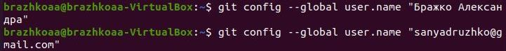{#fig:002 width=70%}

Настроим utf-8 в выводе сообщений git, зададим имя начальной ветке
(будем называть её master), укажем значение параметров autocrlf и safecrlf (рис. [-@fig:003]).
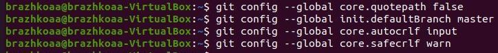{#fig:002 width=70%}

Для последующей идентификации пользователя на сервере
репозиториев сгенерируем пару ключей (приватный и открытый) (рис. [-@fig:004]).
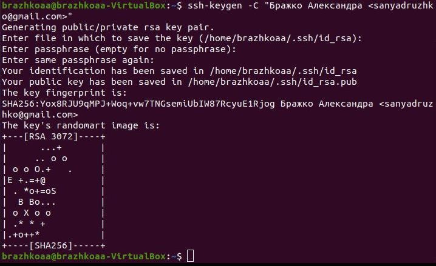{#fig:004 width=70%}

Далее загрузим сгенерированный открытый ключ на Github,
предварительно скопировав его в буфер обмена (рис. [-@fig:005], рис. [-@fig:006]).
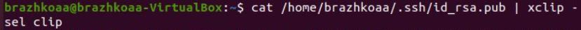{#fig:005 width=70%}
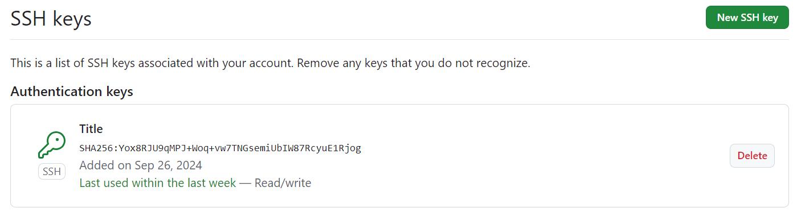{#fig:006 width=70%}

Создадим каталог для предмета «Архитектура компьютера» для
последующего создания рабочего пространства (рис. [-@fig:007]).
{#fig:007 width=70%}

Через web-интерфейс github создадим репозиторий на основе шаблона, указав
имя study_2024–2025_arh-рс (на момент создания отчёта репозиторий был уже
создан, поэтому рис. 3.8 – фото создания нового репозитория, рис. 3.9 – фото
созданного репозитория для лабораторной работы) (рис. [-@fig:008], рис. [-@fig:009]).
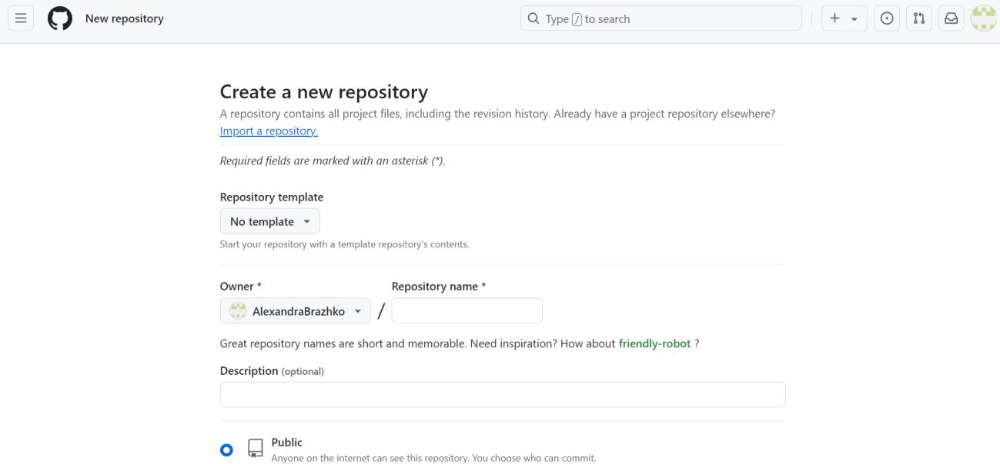{#fig:008 width=70%}
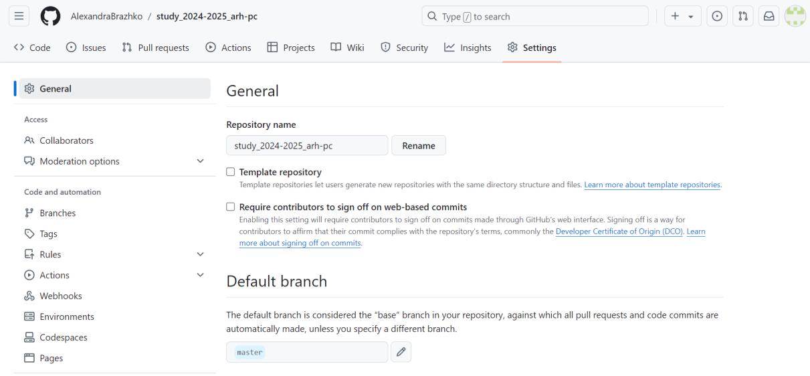{#fig:009 width=70%}

Перейдем в каталог курса и скопируем в него созданный репозиторий с
помощью ссылки для клонирования (рис. [-@fig:010], рис. [-@fig:011]).
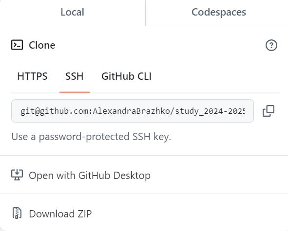{#fig:010 width=70%}
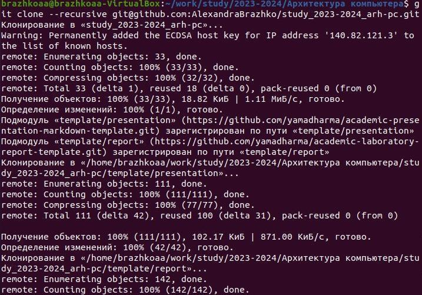{#fig:011 width=70%}

Перейдём в каталог курса, удалим лишние файлы, создадим нужные
каталоги и загрузим файлы на сервер (рис. [-@fig:012], рис. [-@fig:013], рис. [-@fig:014]).
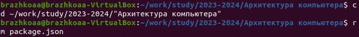{#fig:012 width=70%}
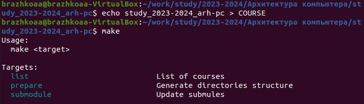{#fig:013 width=70%}
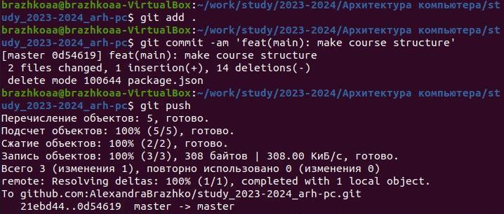{#fig:014 width=70%}

Проверим правильность введённых команд (рис. [-@fig:015]).
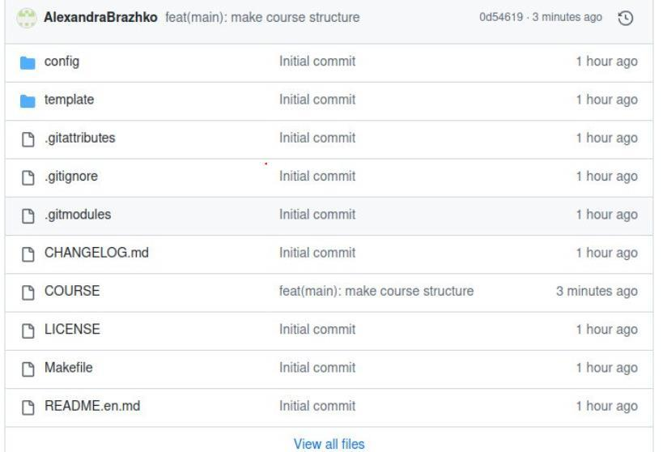{#fig:015 width=70%}

Приступим к выполнению заданий для самостоятельной работы.
Скопируем отчёты по выполнению прошлых лабораторных работ и переместим
отчет по выполнению данной лабораторной работы в соответствующих
каталогах рабочего пространства (рис. [-@fig:016], рис. [-@fig:017]).
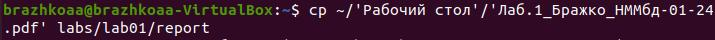{#fig:0016 width=70%}
{#fig:017 width=70%}

Загрузим файлы на сервер (рис. [-@fig:018]).
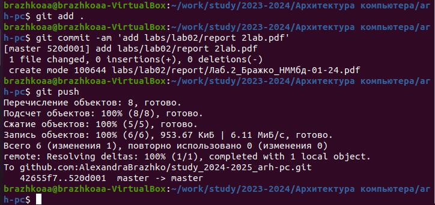{#fig:018 width=70%}
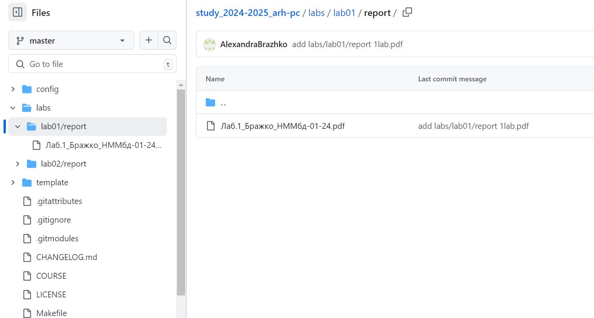{#fig:019 width=70%}
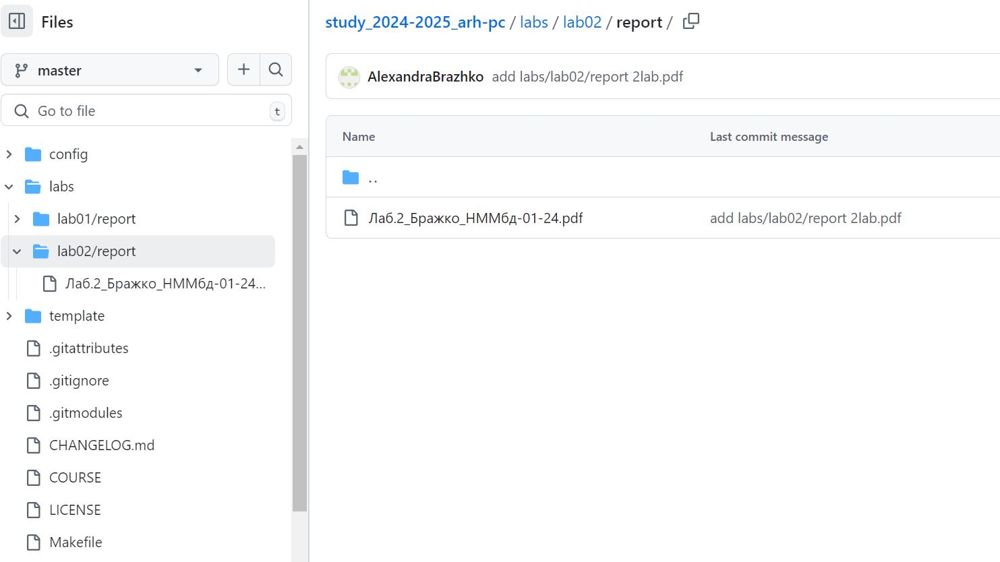{#fig:020 width=70%}

# Выводы

В ходе выполнения этой я научилась настраивать github, создавать SSH ключ,
придерживаться структуры рабочего пространства, настраивать каталог курса и
приобрела практические навыки работы с git.

# Список литературы{.unnumbered}

::: {#refs}
:::
