---
## Front matter
title: "Отчёт по лабораторной работе №3"
subtitle: "дисциплина: Архитектура компьютера"
author: "Бражко Александра Александровна"

## Generic otions
lang: ru-RU
toc-title: "Содержание"

## Bibliography
bibliography: bib/cite.bib
csl: pandoc/csl/gost-r-7-0-5-2008-numeric.csl

## Pdf output format
toc: true # Table of contents
toc-depth: 2
lof: true # List of figures
lot: true # List of tables
fontsize: 12pt
linestretch: 1.5
papersize: a4
documentclass: scrreprt
## I18n polyglossia
polyglossia-lang:
  name: russian
  options:
	- spelling=modern
	- babelshorthands=true
polyglossia-otherlangs:
  name: english
## I18n babel
babel-lang: russian
babel-otherlangs: english
## Fonts
mainfont: IBM Plex Serif
romanfont: IBM Plex Serif
sansfont: IBM Plex Sans
monofont: IBM Plex Mono
mathfont: STIX Two Math
mainfontoptions: Ligatures=Common,Ligatures=TeX,Scale=0.94
romanfontoptions: Ligatures=Common,Ligatures=TeX,Scale=0.94
sansfontoptions: Ligatures=Common,Ligatures=TeX,Scale=MatchLowercase,Scale=0.94
monofontoptions: Scale=MatchLowercase,Scale=0.94,FakeStretch=0.9
mathfontoptions:
## Biblatex
biblatex: true
biblio-style: "gost-numeric"
biblatexoptions:
  - parentracker=true
  - backend=biber
  - hyperref=auto
  - language=auto
  - autolang=other*
  - citestyle=gost-numeric
## Pandoc-crossref LaTeX customization
figureTitle: "Рис."
tableTitle: "Таблица"
listingTitle: "Листинг"
lofTitle: "Список иллюстраций"
lotTitle: "Список таблиц"
lolTitle: "Листинги"
## Misc options
indent: true
header-includes:
  - \usepackage{indentfirst}
  - \usepackage{float} # keep figures where there are in the text
  - \floatplacement{figure}{H} # keep figures where there are in the text
---

# Цель работы

Целью работы является освоение процедуры оформления отчетов с помощью легковесного
языка разметки Markdown.

# Задание

1. Заполнение отчёта по выполнению лабораторной работы №3 с помощью языка разметки Markdown.
2. Задание для самостоятельной работы.

# Теоретическое введение

Здесь описываются теоретические аспекты, связанные с выполнением работы.

Например, в табл. [-@tbl:std-dir] приведено краткое описание стандартных каталогов Unix.

: Описание некоторых каталогов файловой системы GNU Linux {#tbl:std-dir}

| Имя каталога | Описание каталога                                                                                                          |
|--------------|----------------------------------------------------------------------------------------------------------------------------|
| `/`          | Корневая директория, содержащая всю файловую                                                                               |
| `/bin `      | Основные системные утилиты, необходимые как в однопользовательском режиме, так и при обычной работе всем пользователям     |
| `/etc`       | Общесистемные конфигурационные файлы и файлы конфигурации установленных программ                                           |
| `/home`      | Содержит домашние директории пользователей, которые, в свою очередь, содержат персональные настройки и данные пользователя |
| `/media`     | Точки монтирования для сменных носителей                                                                                   |
| `/root`      | Домашняя директория пользователя  `root`                                                                                   |
| `/tmp`       | Временные файлы                                                                                                            |
| `/usr`       | Вторичная иерархия для данных пользователя                                                                                 |

Более подробно про Unix см. в [@tanenbaum_book_modern-os_ru; @robbins_book_bash_en; @zarrelli_book_mastering-bash_en; @newham_book_learning-bash_en].

# Выполнение лабораторной работы

Переходим в каталог курса, сформированный при выполнении лабораторной работы №2. (рис. [-@fig:001]).

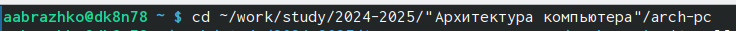{#fig:001 width=70%}

Обновим локальный репозиторий, скачав изменения из удаленного репозитория с помощью команды git pull  (рис. [-@fig:002]).

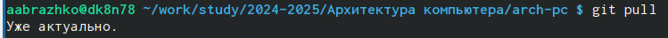{#fig:002 width=70%}

Переходим в каталог с шаблоном отчета по лабораторной работе № 3. (рис. [-@fig:003]).

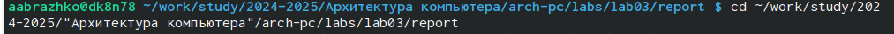{#fig:003 width=70%}

Проведем компиляцию шаблона с использованием Makefile. Для этого вводим команду make. (рис. [-@fig:004]).

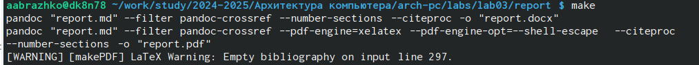{#fig:004 width=70%}

При успешной компиляции должны сгенерироваться файлы report.pdf и report.docx. Откроем и проверим корректность полученных файлов. (рис. [-@fig:005]).

{#fig:005 width=70%}

Удалим полученные файлы с использованием Makefile. Для этого введем команду make clean. (рис. [-@fig:006]).

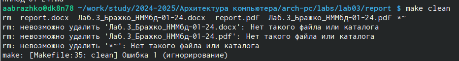{#fig:006 width=70%}

Проверим, что после этой команды файлы report.pdf и report.docx были удалены. (рис. [-@fig:007]).

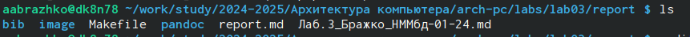{#fig:007 width=70%}

Откроем файл report.md c помощью любого текстового редактора, например gedit. (рис. [-@fig:008]).

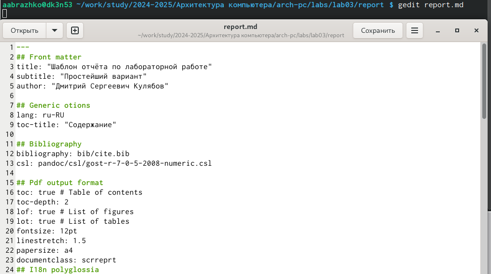{#fig:008 width=70%}

Внимательно изучаем структуру этого файла и заполняем отчёт. (рис. [-@fig:009], рис. [-@fig:010]).

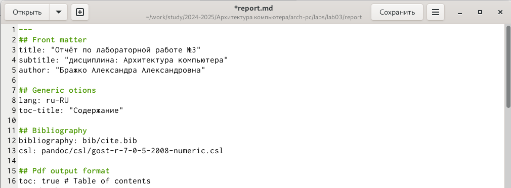{#fig:009 width=70%}

{#fig:010 width=70%}

Скомпилируем отчет с использованием Makefile и проверим их наличие.  (рис. [-@fig:011]).

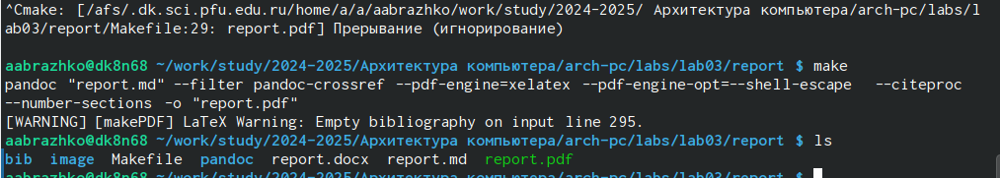{#fig:011 width=70%}

Загружаем файлы на Github. (рис. [-@fig:012], рис. [-@fig:013], рис. [-@fig:014]).

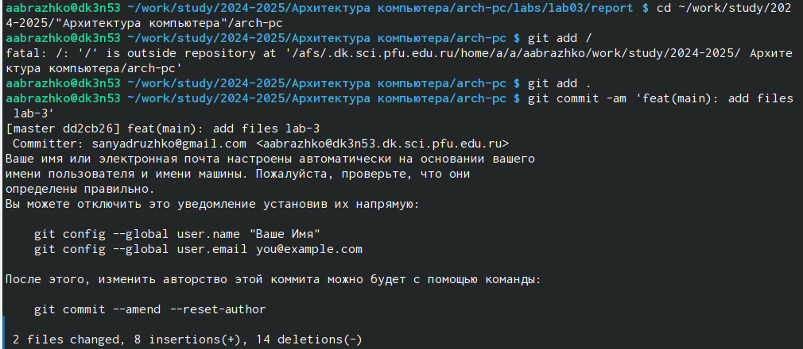{#fig:012 width=70%}

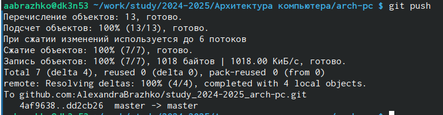{#fig:013 width=70%}

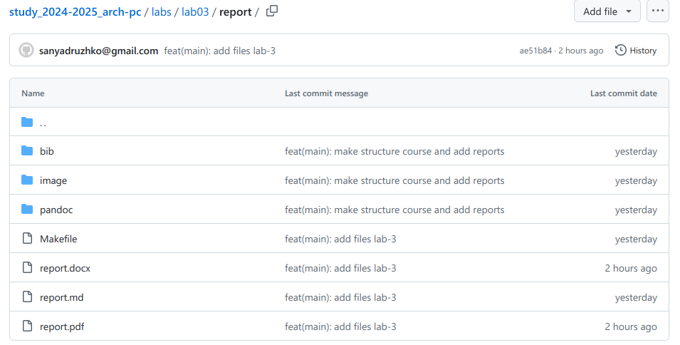{#fig:014 width=70%}

В соответствующем каталоге сделаем отчёт по лабораторной работе № 2 в формате Markdown и предоставляем их в трёх форматах (.pdf, .docx, .md). (рис. [-@fig:015]).

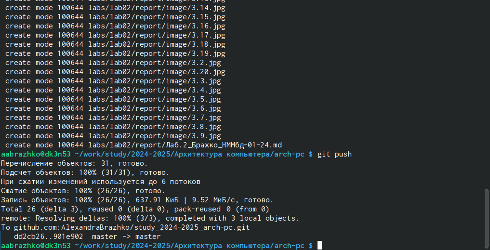{#fig:015 width=70%}

Загружаем на Github (рис. [-@fig:016]).

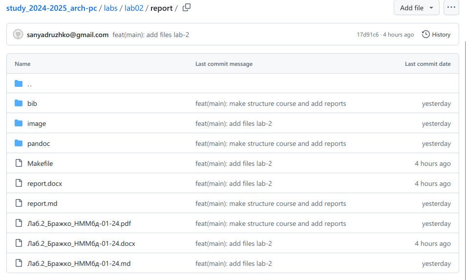{#fig:016 width=70%}

# Выводы

В результате выполнения данной лабораторной работы я освоила процедуры оформления отчетов с помощью легковесного языка разметки Markdown.

# Список литературы{.unnumbered}

::: {#refs}
:::
