---
## Front matter
title: "Отчёт по лабораторной работе №6"
subtitle: "дисциплина: архитектура компьютера"
author: "Бражко Александра Александровна"

## Generic otions
lang: ru-RU
toc-title: "Содержание"

## Bibliography
bibliography: bib/cite.bib
csl: pandoc/csl/gost-r-7-0-5-2008-numeric.csl

## Pdf output format
toc: true # Table of contents
toc-depth: 2
lof: true # List of figures
lot: true # List of tables
fontsize: 12pt
linestretch: 1.5
papersize: a4
documentclass: scrreprt
## I18n polyglossia
polyglossia-lang:
  name: russian
  options:
	- spelling=modern
	- babelshorthands=true
polyglossia-otherlangs:
  name: english
## I18n babel
babel-lang: russian
babel-otherlangs: english
## Fonts
mainfont: IBM Plex Serif
romanfont: IBM Plex Serif
sansfont: IBM Plex Sans
monofont: IBM Plex Mono
mathfont: STIX Two Math
mainfontoptions: Ligatures=Common,Ligatures=TeX,Scale=0.94
romanfontoptions: Ligatures=Common,Ligatures=TeX,Scale=0.94
sansfontoptions: Ligatures=Common,Ligatures=TeX,Scale=MatchLowercase,Scale=0.94
monofontoptions: Scale=MatchLowercase,Scale=0.94,FakeStretch=0.9
mathfontoptions:
## Biblatex
biblatex: true
biblio-style: "gost-numeric"
biblatexoptions:
  - parentracker=true
  - backend=biber
  - hyperref=auto
  - language=auto
  - autolang=other*
  - citestyle=gost-numeric
## Pandoc-crossref LaTeX customization
figureTitle: "Рис."
tableTitle: "Таблица"
listingTitle: "Листинг"
lofTitle: "Список иллюстраций"
lotTitle: "Список таблиц"
lolTitle: "Листинги"
## Misc options
indent: true
header-includes:
  - \usepackage{indentfirst}
  - \usepackage{float} # keep figures where there are in the text
  - \floatplacement{figure}{H} # keep figures where there are in the text
---

# Цель работы

Освоение арифметических инструкций языка ассемблера NASM.

# Задание

1. Символьные и численные данные в NASM
2. Выполнение арифметических операций в NASM
3. Задание для самостоятельной работы

# Теоретическое введение

Здесь описываются теоретические аспекты, связанные с выполнением работы.

Например, в табл. [-@tbl:std-dir] приведено краткое описание стандартных каталогов Unix.

: Описание некоторых каталогов файловой системы GNU Linux {#tbl:std-dir}

| Имя каталога | Описание каталога                                                                                                          |
|--------------|----------------------------------------------------------------------------------------------------------------------------|
| `/`          | Корневая директория, содержащая всю файловую                                                                               |
| `/bin `      | Основные системные утилиты, необходимые как в однопользовательском режиме, так и при обычной работе всем пользователям     |
| `/etc`       | Общесистемные конфигурационные файлы и файлы конфигурации установленных программ                                           |
| `/home`      | Содержит домашние директории пользователей, которые, в свою очередь, содержат персональные настройки и данные пользователя |
| `/media`     | Точки монтирования для сменных носителей                                                                                   |
| `/root`      | Домашняя директория пользователя  `root`                                                                                   |
| `/tmp`       | Временные файлы                                                                                                            |
| `/usr`       | Вторичная иерархия для данных пользователя                                                                                 |

Более подробно про Unix см. в [@tanenbaum_book_modern-os_ru; @robbins_book_bash_en; @zarrelli_book_mastering-bash_en; @newham_book_learning-bash_en].

# Символьные и численные данные в NASM

Создаём каталог для программ лабораторной работы № 6, переходим в него и создаём файл-lab6.asm (рис. [-@fig:001]).

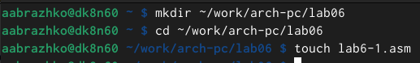{#fig:001 width=70%}

Копируем в текущий каталог файл in_out.asm (рис. [-@fig:002]).

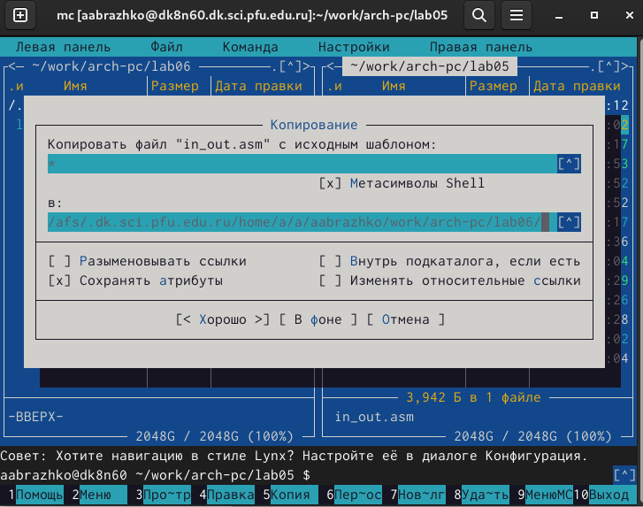{#fig:002 width=70%}

Открываем созданный файл lab6-1.asm, вставляем в него программу вывода значения регистра eax (рис. [-@fig:003]).

{#fig:003 width=70%}

Создаём и запускаем исполняемый файл. Программа в итоге должна вывести j (рис. [-@fig:004]).

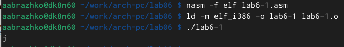{#fig:004 width=70%}

В программе изменяем '4' и '6' на 4 и 6 (рис. [-@fig:005]).

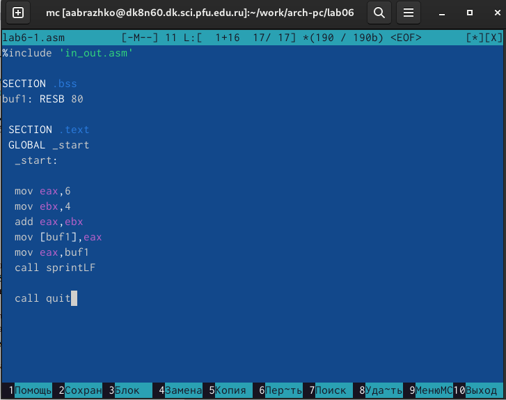{#fig:005 width=70%}

Создаём и запускаем исполняемый файл. Программа в итоге должна вывести символ с кодом 10, но этот символ не отображается при выводе на экран (рис. [-@fig:006]).

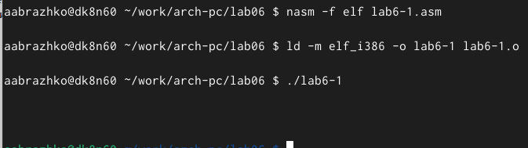{#fig:006 width=70%}

Создаём файл lab6-2.asm в каталоге ~/work/arch-pc/lab06 (рис. [-@fig:007]).

{#fig:007 width=70%}

Вводим в него текст программы из листинга 6.2  (рис. [-@fig:008]).

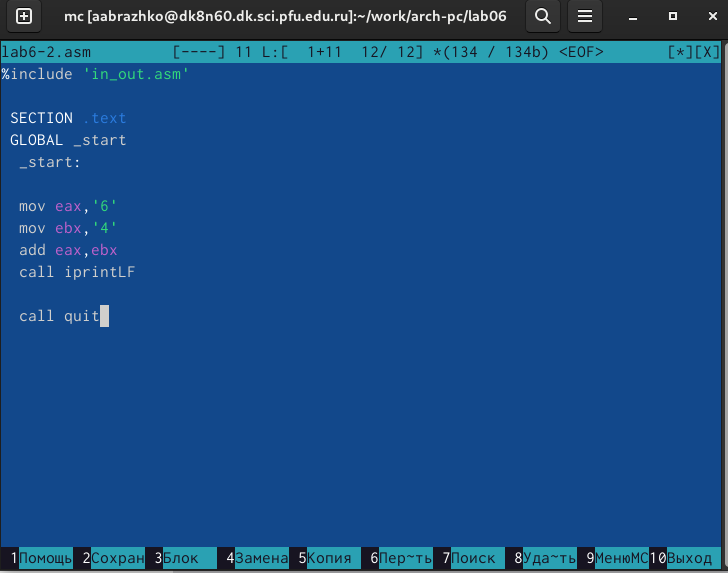{#fig:008 width=70%}

Создаём и запускаем исполняемый файл. Программа в итоге должна вывести 106 (рис. [-@fig:009]).

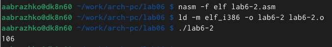{#fig:009 width=70%}

В программе изменяем '4' и '6' на 4 и 6 (рис. [-@fig:010]).

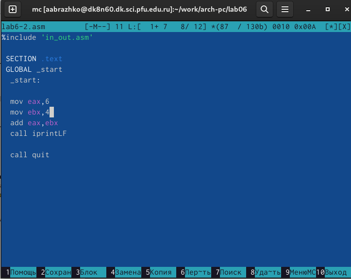{#fig:010 width=70%}

Создаём и запускаем исполняемый файл. Программа в итоге должна вывести 10 (рис. [-@fig:011]).

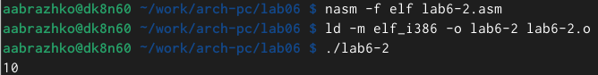{#fig:011 width=70%}

Заменяем функцию iprintLF на iprint. Создаём исполняемый файл и запускаем его. Разницей между ipintLF и  iprint является количество строк вывода (рис. [-@fig:012]).

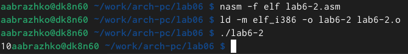{#fig:012 width=70%}

# Выполнение арифметических операций в NASM

Создаём файл lab6-3.asm в каталоге ~/work/arch-pc/lab06 (рис. [-@fig:013]).

{#fig:013 width=70%}

Открываем созданный файл lab6-3.asm, вставляем в него текст программы из листинга 6.3 (рис. [-@fig:014]).

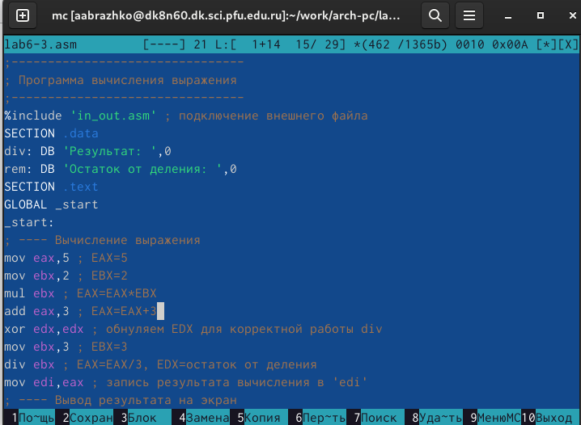{#fig:014 width=70%}

Создаём и запускаем исполняемый файл (рис. [-@fig:015]).

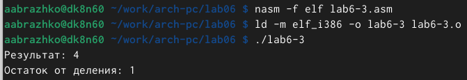{#fig:015 width=70%}

Изменяяем текст программы для вычисления выражения 𝑓(𝑥) = (4 ∗ 6 + 2)/5 (рис. [-@fig:016]).

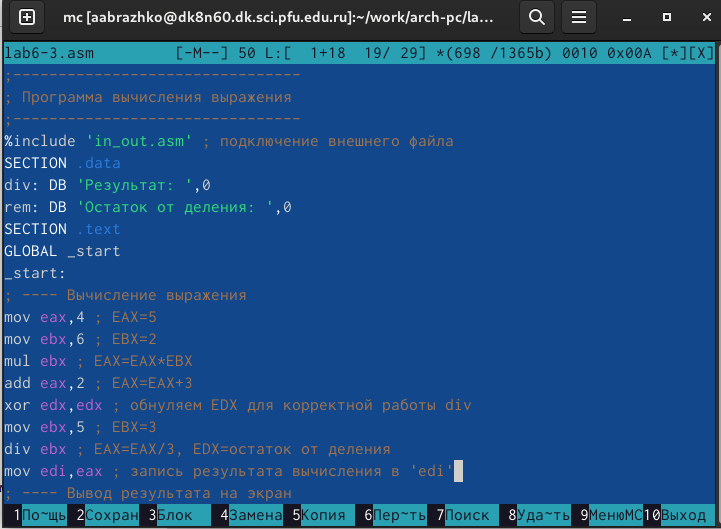{#fig:016 width=70%}

Создаём и запускаем исполняемый файл (рис. [-@fig:017]).

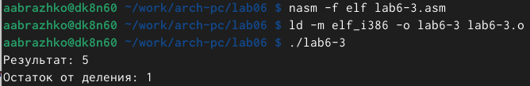{#fig:017 width=70%}

Создаём файл variant.asm в каталоге ~/work/arch-pc/lab06 (рис. [-@fig:018]).

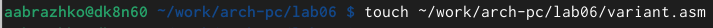{#fig:018 width=70%}

Открываем созданный файл variant.asm, вставляем в него текст программы из листинга 6.4 (рис. [-@fig:019]).

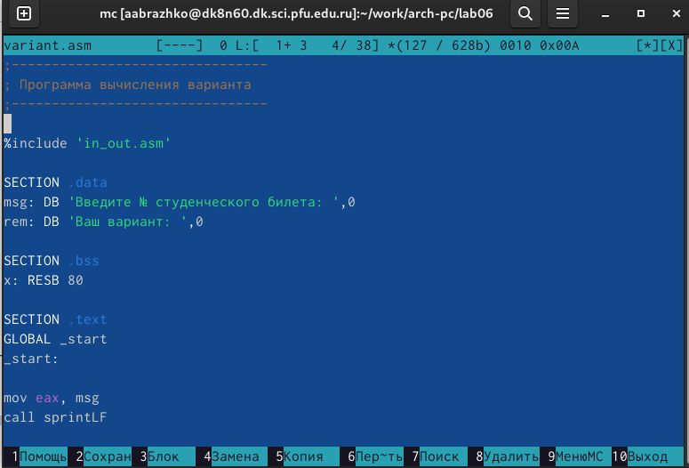{#fig:019 width=70%}

Создаём и запускаем исполняемый файл (рис. [-@fig:020]).

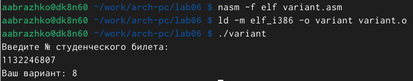{#fig:020 width=70%}

# Ответы на вопросы

1) Какие строки листинга 6.4 отвечают за вывод на экран сообщения ‘Ваш вариант:’?

mov eax,rem
call sprint

2) Для чего используется следующие инструкции?
mov ecx, x
mov edx, 80
call sread

инструкция mov ecx, x используется для того, чтобы положить адрес вводимой строки x в регистр.
ecx mov edx, 80 - запись в регистр edx длины вводимой строки.
call sread - вызов подпрограммы из внешнего файла, обеспечивающей ввод сообщения с клавиатуры.

3) Для чего используется инструкция “call atoi”?

Call atoi используется для вызова подпрограммы из внешнего файла, которая преобразует ascii-код символа в целое число и записывает результат в регистр eax.

4) Какие строки листинга 6.4 отвечают за вычисления варианта?

xor edx,edx 
mov ebx,20
div ebx
inc edx

5) В какой регистр записывается остаток от деления при выполнении инструкции “div ebx”?

При выполнении инструкции div ebx остаток от деления записывается в регистр edx.

6) Для чего используется инструкция “inc edx”?

Инструкция inc edx увеличивает значение регистра edx на 1.

7) Какие строки листинга 6.4 отвечают за вывод на экран результата вычислений?

mov eax,edx
call iprintLF

# Выполнение заданий для самостоятельной работы

Создаём файл lab6-4.asm в каталоге ~/work/arch-pc/lab06 (рис. [-@fig:021]).

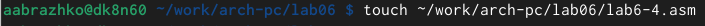{#fig:021 width=70%}

Открываем созданный файл lab6-4.asm и вводим в него текст программы для вычисления значения выражения для 8 варианта: (11+x)*2-6 (рис. [-@fig:022]).

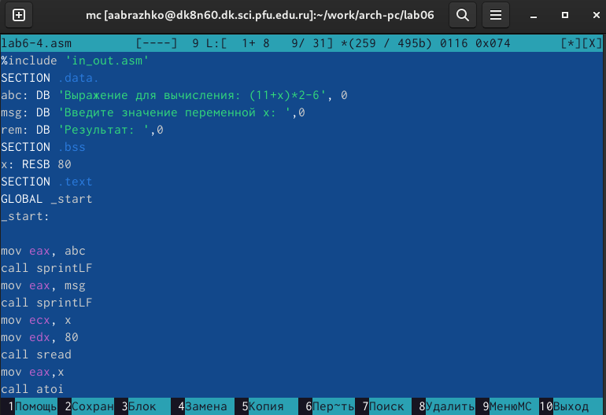{#fig:022 width=70%}

Создаём и запускаем исполняемый файл для х=1 и x=9 (рис. [-@fig:024], рис. [-@fig:025]).

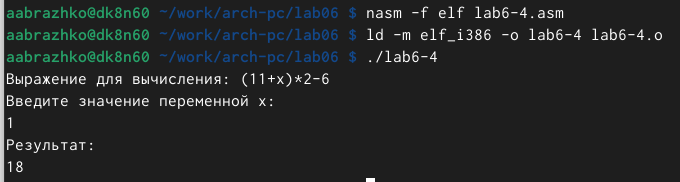{#fig:024 width=70%}

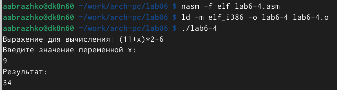{#fig:025 width=70%}

# Выводы

При выполнении данной лабораторной работы я освоила арифметические инструкции языка ассемблера NASM.

# Список литературы{.unnumbered}

::: {#refs}
:::
