---
## Front matter
title: "Отчёт по лабораторной работе №7"
subtitle: "Дисциплина: Архитектура компьютера"
author: "Бражко Александра Александровна"

## Generic otions
lang: ru-RU
toc-title: "Содержание"

## Bibliography
bibliography: bib/cite.bib
csl: pandoc/csl/gost-r-7-0-5-2008-numeric.csl

## Pdf output format
toc: true # Table of contents
toc-depth: 2
lof: true # List of figures
lot: true # List of tables
fontsize: 12pt
linestretch: 1.5
papersize: a4
documentclass: scrreprt
## I18n polyglossia
polyglossia-lang:
  name: russian
  options:
	- spelling=modern
	- babelshorthands=true
polyglossia-otherlangs:
  name: english
## I18n babel
babel-lang: russian
babel-otherlangs: english
## Fonts
mainfont: IBM Plex Serif
romanfont: IBM Plex Serif
sansfont: IBM Plex Sans
monofont: IBM Plex Mono
mathfont: STIX Two Math
mainfontoptions: Ligatures=Common,Ligatures=TeX,Scale=0.94
romanfontoptions: Ligatures=Common,Ligatures=TeX,Scale=0.94
sansfontoptions: Ligatures=Common,Ligatures=TeX,Scale=MatchLowercase,Scale=0.94
monofontoptions: Scale=MatchLowercase,Scale=0.94,FakeStretch=0.9
mathfontoptions:
## Biblatex
biblatex: true
biblio-style: "gost-numeric"
biblatexoptions:
  - parentracker=true
  - backend=biber
  - hyperref=auto
  - language=auto
  - autolang=other*
  - citestyle=gost-numeric
## Pandoc-crossref LaTeX customization
figureTitle: "Рис."
tableTitle: "Таблица"
listingTitle: "Листинг"
lofTitle: "Список иллюстраций"
lotTitle: "Список таблиц"
lolTitle: "Листинги"
## Misc options
indent: true
header-includes:
  - \usepackage{indentfirst}
  - \usepackage{float} # keep figures where there are in the text
  - \floatplacement{figure}{H} # keep figures where there are in the text
---

# Цель работы

Изучение команд условного и безусловного переходов. Приобретение навыков написания
программ с использованием переходов. Знакомство с назначением и структурой файла
листинга.

# Задание

1. Реализация переходов в NASM
2. Изучение структуры файлы листинга
3. Задание для самостоятельной работы

# Теоретическое введение

Здесь описываются теоретические аспекты, связанные с выполнением работы.

Например, в табл. [-@tbl:std-dir] приведено краткое описание стандартных каталогов Unix.

: Описание некоторых каталогов файловой системы GNU Linux {#tbl:std-dir}

| Имя каталога | Описание каталога                                                                                                          |
|--------------|----------------------------------------------------------------------------------------------------------------------------|
| `/`          | Корневая директория, содержащая всю файловую                                                                               |
| `/bin `      | Основные системные утилиты, необходимые как в однопользовательском режиме, так и при обычной работе всем пользователям     |
| `/etc`       | Общесистемные конфигурационные файлы и файлы конфигурации установленных программ                                           |
| `/home`      | Содержит домашние директории пользователей, которые, в свою очередь, содержат персональные настройки и данные пользователя |
| `/media`     | Точки монтирования для сменных носителей                                                                                   |
| `/root`      | Домашняя директория пользователя  `root`                                                                                   |
| `/tmp`       | Временные файлы                                                                                                            |
| `/usr`       | Вторичная иерархия для данных пользователя                                                                                 |

Более подробно про Unix см. в [@tanenbaum_book_modern-os_ru; @robbins_book_bash_en; @zarrelli_book_mastering-bash_en; @newham_book_learning-bash_en].

# Выполнение лабораторной работы

Создаём каталог для программ лабораторной работы № 7, переходим в него и создаём файл lab7-1.asm (рис. [-@fig:001]).

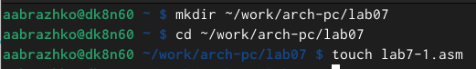{#fig:001 width=70%}

Вводим в файл lab7-1.asm текст программы из листинга 7.1 (рис. [-@fig:002]).

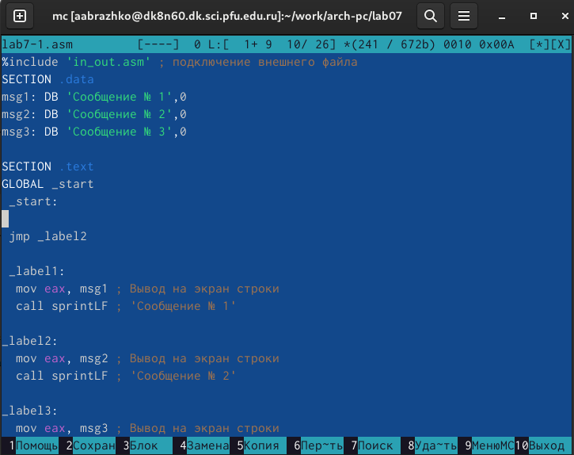{#fig:002 width=70%}

Создаём исполняемый файл и запускаем его. Результатом работы данной программы будет: 
Сообщение № 2
Сообщение № 3  (рис. [-@fig:003]).

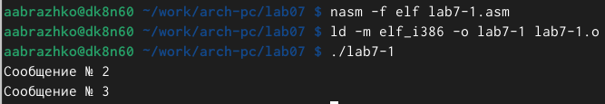{#fig:003 width=70%}

Изменим программу таким образом, чтобы она выводила сначала ‘Сообщение № 2’, потом ‘Сообщение № 1’ и завершала работу. Изменим текст программы в соответствии с листингом 7.2 (рис. [-@fig:004]).

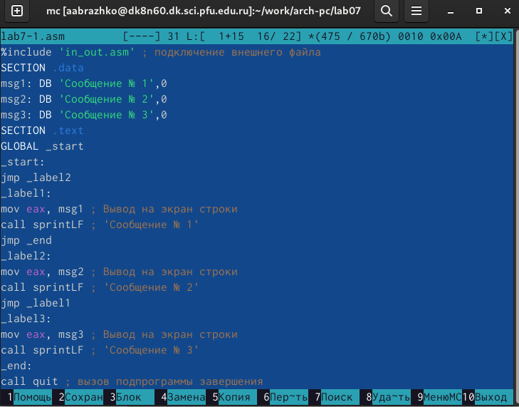{#fig:004 width=70%}

Создаём исполняемый файл и запускаем его. Результатом работы данной программы будет: 
Сообщение № 2
Сообщение № 1 (рис. [-@fig:005]).

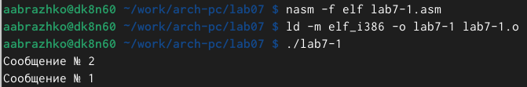{#fig:005 width=70%}

Изменим текст программы так, чтобы вывод программы был:
Сообщение № 3
Сообщение № 2
Сообщение № 1 (рис. [-@fig:006]).

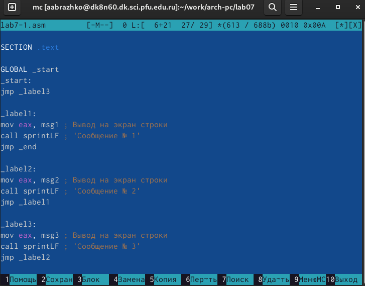{#fig:006 width=70%}

Создаём исполняемый файл и запускаем его (рис. [-@fig:007]).

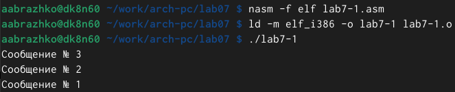{#fig:007 width=70%}

Создаём файл lab7-2.asm в каталоге ~/work/arch-pc/lab07 (рис. [-@fig:008]).

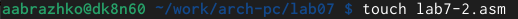{#fig:008 width=70%}

Вводим текст программы из листинга 7.3 в lab7-2.asm. (рис. [-@fig:009]).

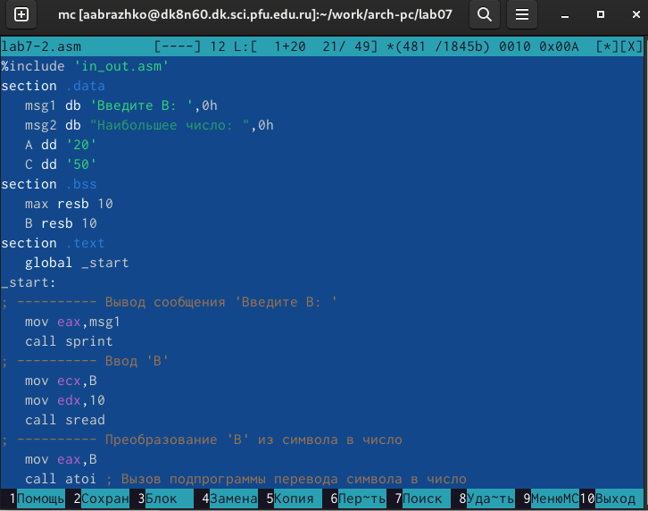{#fig:009 width=70%}

Создаём исполняемый файл и проверяем его работу для разных значений B (рис. [-@fig:010]).

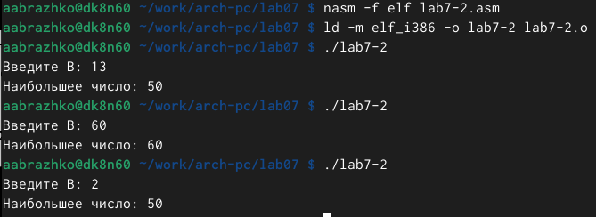{#fig:010 width=70%}

Создаём файл листинга для программы из файла lab7-2.asm. Откроем файл листинга lab7-2.lst с помощью текстового редактора mcedit (рис. [-@fig:011]).

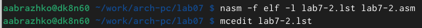{#fig:011 width=70%}

Ознакомившись с форматом файла и его содержимым, мы можем сказать, что:
1) cтрока находится на 66 месте, ее адрес "0000004A", машинный код - В8[03000000], mov eax,3 - исходный текст программы, означающий что в регистр eax мы вносим значение переменной 3 (рис. [-@fig:012]).

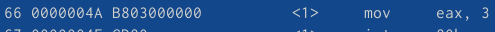{#fig:012 width=70%}

2) строка находится на 22 месте, ее адрес "00000101", машинный код - E896FFFFFF, call atoi - исходный текст программы, означающий что символ лежащий в строке выше переводится в число (рис. [-@fig:013]).

{#fig:013 width=70%}

3) строка находится на 47 месте, ее адрес "0000015E", машинный код - A1[00000000], mov eax,[max] - исходный текст программы, означающий что число хранившееся в переменной max записывается в регистр eax (рис. [-@fig:014]).

{#fig:014 width=70%}

В строке mov eax,max мы убираем max и пробуем создать файл. программа выдаёт ошибку, так как для программы нужно два операнда (рис. [-@fig:015]).

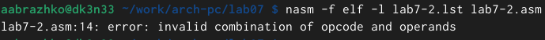{#fig:015 width=70%}

В файле листинга мы можем увидеть, где ошибка и с чем она связана (рис. [-@fig:016]).

{#fig:016 width=70%}

# Выполнение самостоятельной работы

Пишем программу нахождения наименьшей из 3 целочисленных переменных A, B, C. Значения переменных берём из табл. 7.5 в соответствии с вариантом (у меня вариант #8), полученным при выполнении лабораторной работы № 7. Создаём файл lab7-3-1.asm в каталоге ~/work/arch-pc/lab07 (рис. [-@fig:017]).

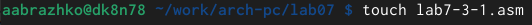{#fig:017 width=70%}

Пишем программу (рис. [-@fig:018]).

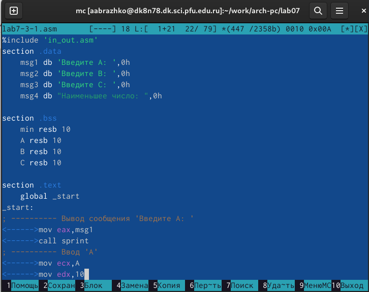{#fig:018 width=70%}

Создаём исполняемый файл и проверяем его работу (рис. [-@fig:019]).

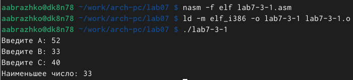{#fig:019 width=70%}

Пишем программу, которая для введенных с клавиатуры значений 𝑥 и 𝑎 вычисляет значение заданной функции 𝑓(𝑥) и выводит результат вычислений. Вид функции 𝑓(𝑥) берём из таблицы 7.6 в соответствии с вариантом (у меня вариант #8), полученным при выполнении лабораторной работы № 7. Создаём файл lab7-3-2.asm в каталоге ~/work/arch-pc/lab07 (рис. [-@fig:020]).

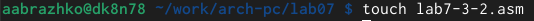{#fig:020 width=70%}

Пишем программу (рис. [-@fig:021]).

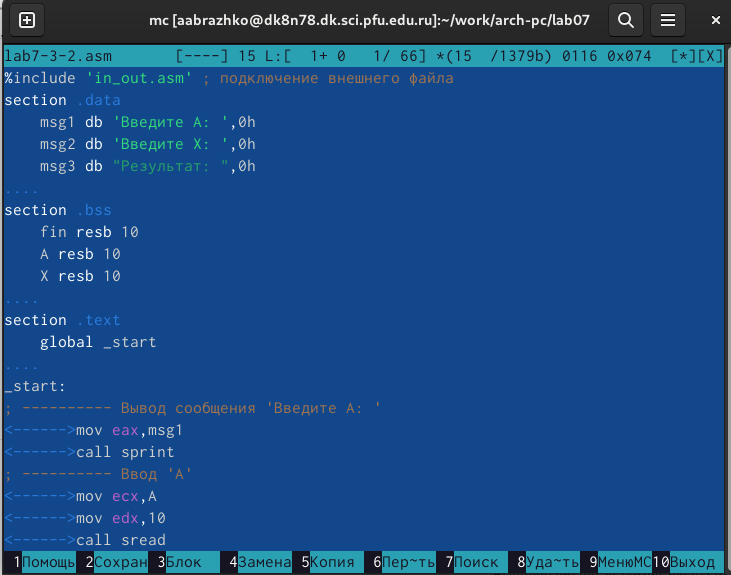{#fig:021 width=70%}

Создаём исполняемый файл и проверяем его работу для разных значений x и a (рис. [-@fig:022]).

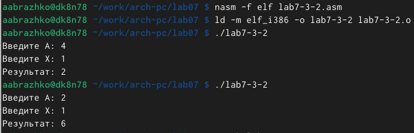{#fig:022 width=70%}

# Выводы

Мы изучили команды условного и безусловного перехода. Приобрели навыки написания программ с переходами.

# Список литературы{.unnumbered}

::: {#refs}
:::
