---
## Front matter
title: "Отчёт по лабораторной работе №8"
subtitle: "дисциплина: Архитектура компьютера"
author: "Бражко Александра Александровна"

## Generic otions
lang: ru-RU
toc-title: "Содержание"

## Bibliography
bibliography: bib/cite.bib
csl: pandoc/csl/gost-r-7-0-5-2008-numeric.csl

## Pdf output format
toc: true # Table of contents
toc-depth: 2
lof: true # List of figures
lot: true # List of tables
fontsize: 12pt
linestretch: 1.5
papersize: a4
documentclass: scrreprt
## I18n polyglossia
polyglossia-lang:
  name: russian
  options:
	- spelling=modern
	- babelshorthands=true
polyglossia-otherlangs:
  name: english
## I18n babel
babel-lang: russian
babel-otherlangs: english
## Fonts
mainfont: IBM Plex Serif
romanfont: IBM Plex Serif
sansfont: IBM Plex Sans
monofont: IBM Plex Mono
mathfont: STIX Two Math
mainfontoptions: Ligatures=Common,Ligatures=TeX,Scale=0.94
romanfontoptions: Ligatures=Common,Ligatures=TeX,Scale=0.94
sansfontoptions: Ligatures=Common,Ligatures=TeX,Scale=MatchLowercase,Scale=0.94
monofontoptions: Scale=MatchLowercase,Scale=0.94,FakeStretch=0.9
mathfontoptions:
## Biblatex
biblatex: true
biblio-style: "gost-numeric"
biblatexoptions:
  - parentracker=true
  - backend=biber
  - hyperref=auto
  - language=auto
  - autolang=other*
  - citestyle=gost-numeric
## Pandoc-crossref LaTeX customization
figureTitle: "Рис."
tableTitle: "Таблица"
listingTitle: "Листинг"
lofTitle: "Список иллюстраций"
lotTitle: "Список таблиц"
lolTitle: "Листинги"
## Misc options
indent: true
header-includes:
  - \usepackage{indentfirst}
  - \usepackage{float} # keep figures where there are in the text
  - \floatplacement{figure}{H} # keep figures where there are in the text
---

# Цель работы

Приобретение навыков написания программ с использованием циклов и обработкой аргументов командной строки.

# Задание

1. Реализация циклов в NASM
2. Обработка аргументов командной строки
3. Задание для самостоятельной работы

# Теоретическое введение

Здесь описываются теоретические аспекты, связанные с выполнением работы.

Например, в табл. [-@tbl:std-dir] приведено краткое описание стандартных каталогов Unix.

: Описание некоторых каталогов файловой системы GNU Linux {#tbl:std-dir}

| Имя каталога | Описание каталога                                                                                                          |
|--------------|----------------------------------------------------------------------------------------------------------------------------|
| `/`          | Корневая директория, содержащая всю файловую                                                                               |
| `/bin `      | Основные системные утилиты, необходимые как в однопользовательском режиме, так и при обычной работе всем пользователям     |
| `/etc`       | Общесистемные конфигурационные файлы и файлы конфигурации установленных программ                                           |
| `/home`      | Содержит домашние директории пользователей, которые, в свою очередь, содержат персональные настройки и данные пользователя |
| `/media`     | Точки монтирования для сменных носителей                                                                                   |
| `/root`      | Домашняя директория пользователя  `root`                                                                                   |
| `/tmp`       | Временные файлы                                                                                                            |
| `/usr`       | Вторичная иерархия для данных пользователя                                                                                 |

Более подробно про Unix см. в [@tanenbaum_book_modern-os_ru; @robbins_book_bash_en; @zarrelli_book_mastering-bash_en; @newham_book_learning-bash_en].

# Выполнение лабораторной работы

Создаём каталог для программам лабораторной работы № 8, переходим в него и создаём файл lab8-1.asm (рис. [-@fig:001]).

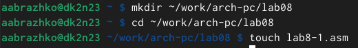{#fig:001 width=70%}

Вводим в файл lab8-1.asm текст программы из листинга 8.1  (рис. [-@fig:002]).

{#fig:002 width=70%}

Создаём исполняемый файл и проверяем его работу. (рис. [-@fig:003]).

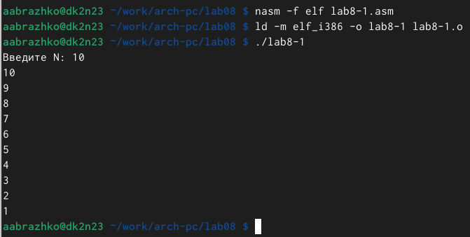{#fig:003 width=70%}

Изменим текст программы, добавив изменение значение регистра ecx в цикле (рис. [-@fig:004]).

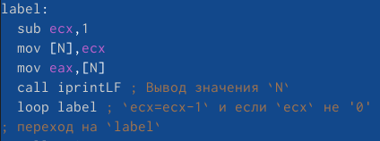{#fig:004 width=70%}

Создаём исполняемый файл и проверяем его работу (рис. [-@fig:005]).

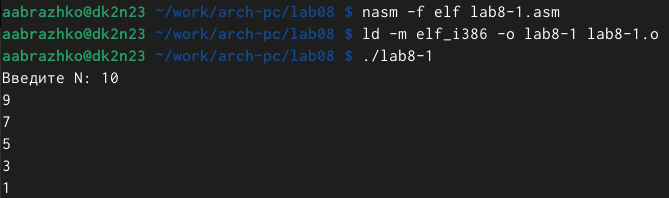{#fig:005 width=70%}

Внесим изменения в текст программы, добавив команды push и pop (рис. [-@fig:006]).

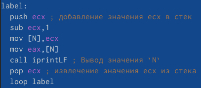{#fig:006 width=70%}

Создаём исполняемый файл и проверяем его работу (рис. [-@fig:007]).

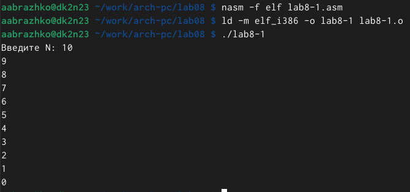{#fig:007 width=70%}

Создаём файл lab8-2.asm в каталоге ~/work/arch-pc/lab08 (рис. [-@fig:008]).

{#fig:008 width=70%}

Вводим в него текст программы из листинга 8.2 (рис. [-@fig:009]).

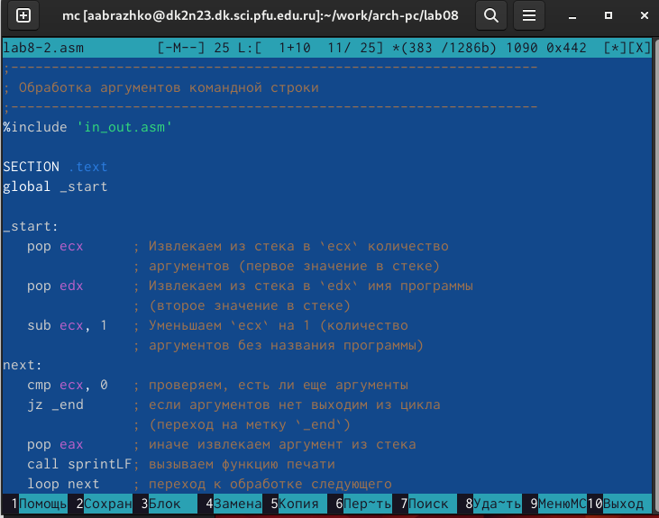{#fig:009 width=70%}

Создаём исполняемый файл и запустим его, указав аргументы:
:~$ ./lab8-2 аргумент1 аргумент 2 'аргумент 3 (рис. [-@fig:010]).

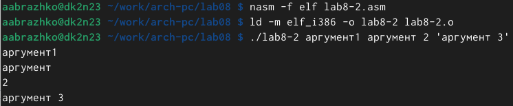{#fig:010 width=70%}

Создаём файл lab8-3.asm в каталоге ~/work/arch-pc/lab08 (рис. [-@fig:011]).

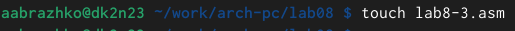{#fig:011 width=70%}

Вводим в него текст программы из листинга 8.3 (рис. [-@fig:012]).

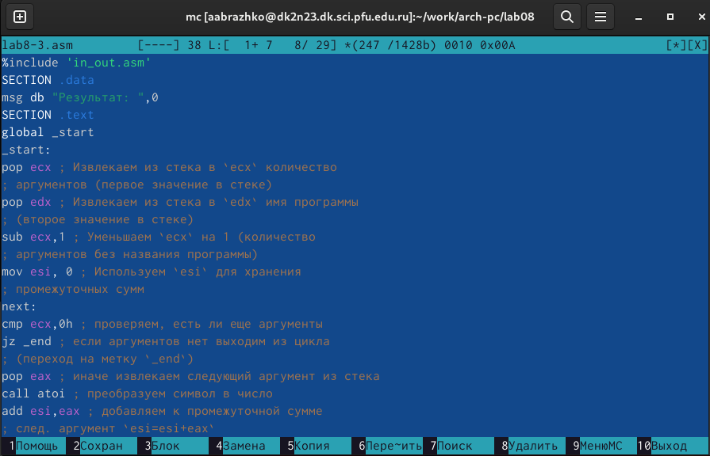{#fig:012 width=70%}

Создаём исполняемый файл и проверяем его работу, указав аргументы 2 13 7 10 5 (рис. [-@fig:013]).

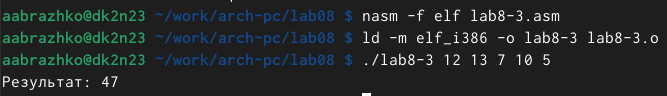{#fig:013 width=70%}

Изменим текст программы из листинга 8.3 для вычисления произведения аргументов командной строки (рис. [-@fig:014]).

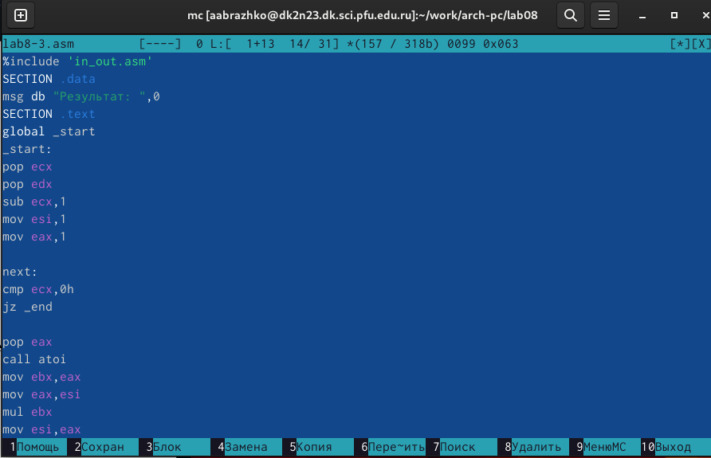{#fig:014 width=70%}

Создаём исполняемый файл и проверяем его работу (рис. [-@fig:015]).

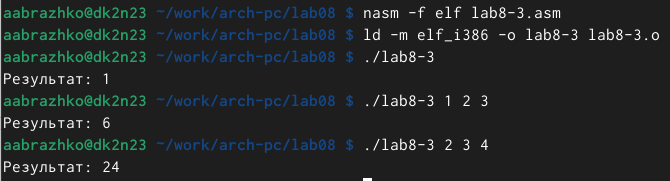{#fig:015 width=70%}

# Выполнение самостоятельной работы

Создаём файл lab8-4.asm в каталоге ~/work/arch-pc/lab08 (рис. [-@fig:016]).

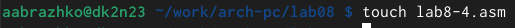{#fig:016 width=70%}

Напишем программу, которая находит сумму значений функции 𝑓(𝑥) для 𝑥 = 𝑥1, 𝑥2, ..., 𝑥𝑛 . Функцию берём из таблицы 8.1 в соответствии с вариантом (у меня №8), полученным при выполнении лабораторной работы № 7 (рис. [-@fig:017]).

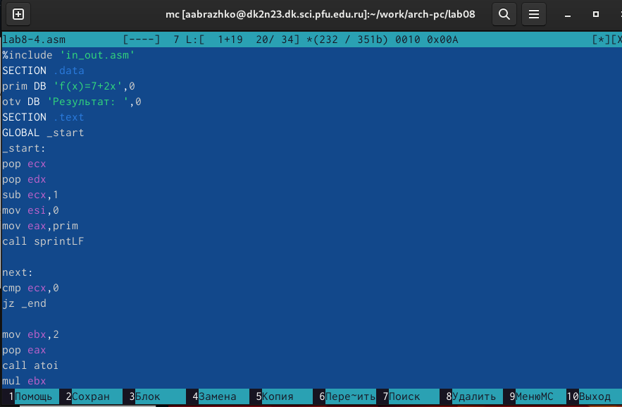{#fig:017 width=70%}

Создайте исполняемый файл и проверьте его работу на нескольких наборах 𝑥 = 𝑥1, 𝑥2, ..., 𝑥𝑛. (рис. [-@fig:018]).

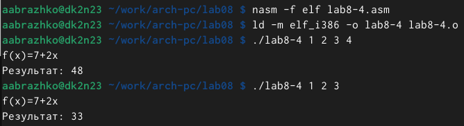{#fig:018 width=70%}

# Выводы

В ходе выполнения работы я приобрела навыков написания программ с использованием циклов и обработкой аргументов командной строки.

# Список литературы{.unnumbered}

::: {#refs}
:::
