---
## Front matter
title: "Отчёт по лабораторной работе №9"
subtitle: "Дисциплина: Архитектура компьютера"
author: "Бражко Александра Александровна"

## Generic otions
lang: ru-RU
toc-title: "Содержание"

## Bibliography
bibliography: bib/cite.bib
csl: pandoc/csl/gost-r-7-0-5-2008-numeric.csl

## Pdf output format
toc: true # Table of contents
toc-depth: 2
lof: true # List of figures
lot: true # List of tables
fontsize: 12pt
linestretch: 1.5
papersize: a4
documentclass: scrreprt
## I18n polyglossia
polyglossia-lang:
  name: russian
  options:
	- spelling=modern
	- babelshorthands=true
polyglossia-otherlangs:
  name: english
## I18n babel
babel-lang: russian
babel-otherlangs: english
## Fonts
mainfont: IBM Plex Serif
romanfont: IBM Plex Serif
sansfont: IBM Plex Sans
monofont: IBM Plex Mono
mathfont: STIX Two Math
mainfontoptions: Ligatures=Common,Ligatures=TeX,Scale=0.94
romanfontoptions: Ligatures=Common,Ligatures=TeX,Scale=0.94
sansfontoptions: Ligatures=Common,Ligatures=TeX,Scale=MatchLowercase,Scale=0.94
monofontoptions: Scale=MatchLowercase,Scale=0.94,FakeStretch=0.9
mathfontoptions:
## Biblatex
biblatex: true
biblio-style: "gost-numeric"
biblatexoptions:
  - parentracker=true
  - backend=biber
  - hyperref=auto
  - language=auto
  - autolang=other*
  - citestyle=gost-numeric
## Pandoc-crossref LaTeX customization
figureTitle: "Рис."
tableTitle: "Таблица"
listingTitle: "Листинг"
lofTitle: "Список иллюстраций"
lotTitle: "Список таблиц"
lolTitle: "Листинги"
## Misc options
indent: true
header-includes:
  - \usepackage{indentfirst}
  - \usepackage{float} # keep figures where there are in the text
  - \floatplacement{figure}{H} # keep figures where there are in the text
---

# Цель работы

Приобретение навыков написания программ с использованием подпрограмм. Знакомство
с методами отладки при помощи GDB и его основными возможностями.

# Задание

1. Реализация подпрограмм в NASM
2. Отладка программам с помощью GDB
3. Задание для самостоятельной работы

# Теоретическое введение

Здесь описываются теоретические аспекты, связанные с выполнением работы.

Например, в табл. [-@tbl:std-dir] приведено краткое описание стандартных каталогов Unix.

: Описание некоторых каталогов файловой системы GNU Linux {#tbl:std-dir}

| Имя каталога | Описание каталога                                                                                                          |
|--------------|----------------------------------------------------------------------------------------------------------------------------|
| `/`          | Корневая директория, содержащая всю файловую                                                                               |
| `/bin `      | Основные системные утилиты, необходимые как в однопользовательском режиме, так и при обычной работе всем пользователям     |
| `/etc`       | Общесистемные конфигурационные файлы и файлы конфигурации установленных программ                                           |
| `/home`      | Содержит домашние директории пользователей, которые, в свою очередь, содержат персональные настройки и данные пользователя |
| `/media`     | Точки монтирования для сменных носителей                                                                                   |
| `/root`      | Домашняя директория пользователя  `root`                                                                                   |
| `/tmp`       | Временные файлы                                                                                                            |
| `/usr`       | Вторичная иерархия для данных пользователя                                                                                 |

Более подробно про Unix см. в [@tanenbaum_book_modern-os_ru; @robbins_book_bash_en; @zarrelli_book_mastering-bash_en; @newham_book_learning-bash_en].

# Выполнение лабораторной работы

Создаём каталог для выполнения лабораторной работы № 9, переходим в него и создаём файл lab9-1.asm (рис. [-@fig:001]).

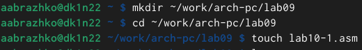{#fig:001 width=70%}

Вводим в файл lab9-1.asm текст программы из листинга 9.1 (рис. [-@fig:002]).

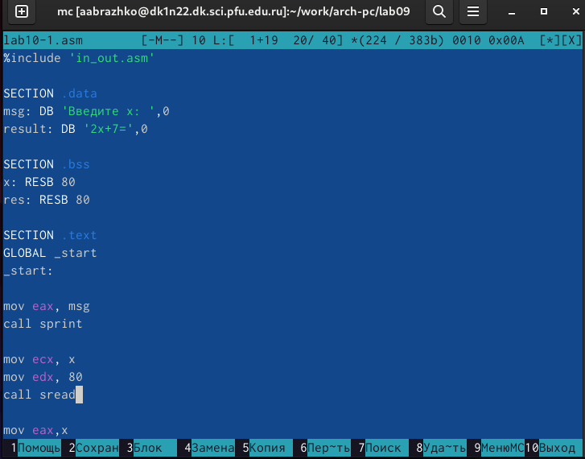{#fig:00 width=70%}

Создаём исполняемый файл и проверяем его работу (рис. [-@fig:003]).

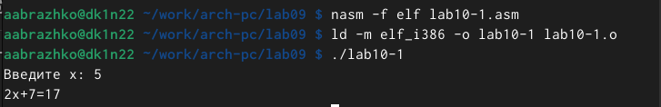{#fig:003 width=70%}

Вносим изменения в программу, чтобы решалось выражение f(g(x)) (рис. [-@fig:004]).

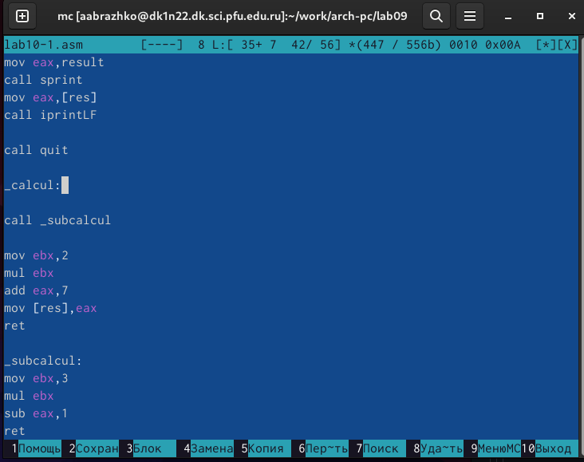{#fig:004 width=70%}

Создаём исполняемый файл и проверяем его работу (рис. [-@fig:005]).

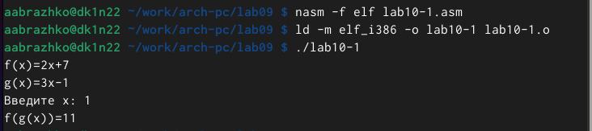{#fig:005 width=70%}

Создаём файл lab9-2.asm (рис. [-@fig:006]).

{#fig:006 width=70%}

Вводим в файл lab9-2.asm текст программы из листинга 9.2 (рис. [-@fig:007]).

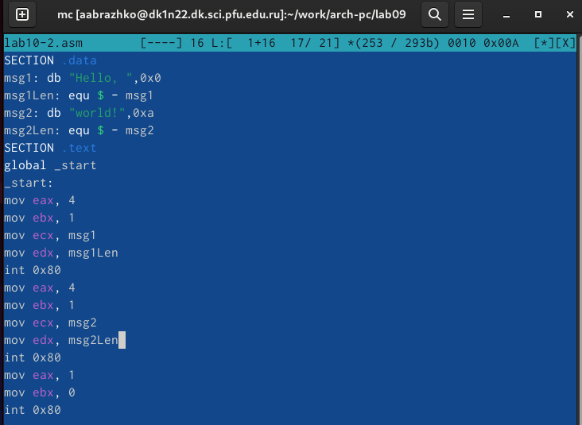{#fig:007 width=70%}

Загружаем и запускаем файл в откладчике gdb (рис. [-@fig:008]).

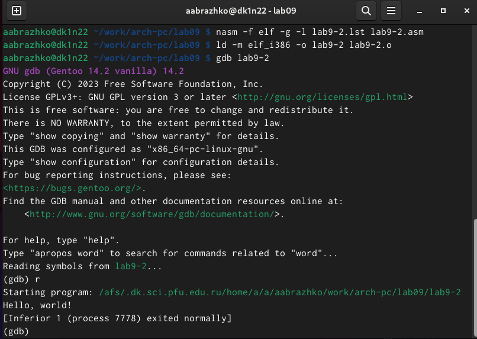{#fig:008 width=70%}

Ставим брекпоинт на метку _start и запускаем программу (рис. [-@fig:009]).

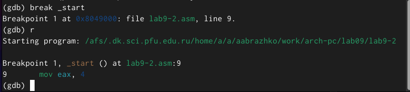{#fig:009 width=70%}

Просматриваем дисассимплированный код программы, начиная с метки (рис. [-@fig:010]).

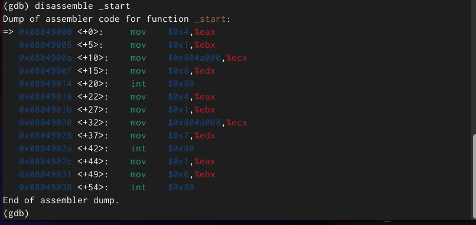{#fig:010 width=70%}

Переключаемся на отображение команд с Intel’овским синтаксисом (рис. [-@fig:011]).

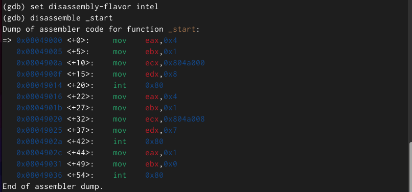{#fig:011 width=70%}

Включим режим псевдографики для более удобного анализа программы (рис. [-@fig:012]).

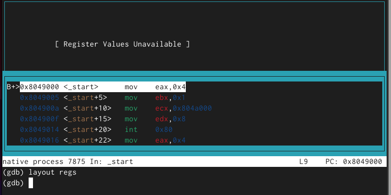{#fig:012 width=70%}

Просмотрим наличие меток и добавим еще одну метку на предпоследнюю инструкцию (рис. [-@fig:013]).

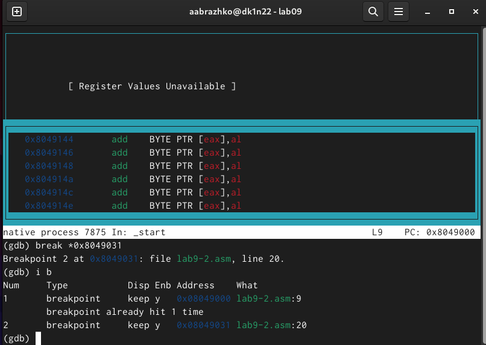{#fig:013 width=70%}

С помощью команды si мы посмотрим регистры и изменим их (рис. [-@fig:014], рис. [-@fig:015]).

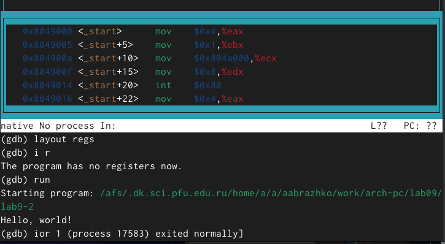{#fig:014 width=70%}

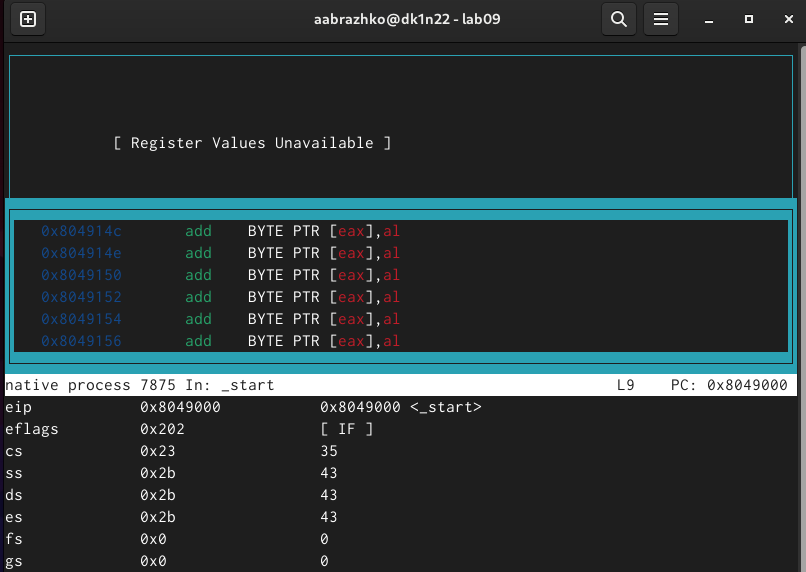{#fig:015 width=70%}

С помощью команды просмотрим значение переменной msg1 (рис. [-@fig:016]).

{#fig:016 width=70%}

Просмотрим значение переменной msg2 (рис. [-@fig:017]).

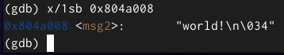{#fig:017 width=70%}

С помощью команды set изменим значение переменной msg1 (рис. [-@fig:018]).

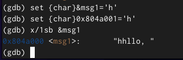{#fig:018 width=70%}

С помощью команды set изменим значение переменной msg2 (рис. [-@fig:019]).

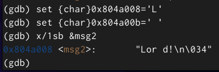{#fig:019 width=70%}

Просмотрим значения регистра edx  (рис. [-@fig:020]).

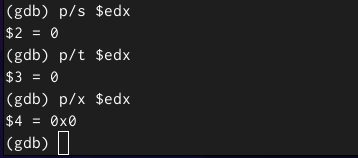{#fig:020 width=70%}

С помощью команды set изменим значения регистра ebx. Команда выводит два разных значения так как в первый раз мы вносим значение 2, а во второй раз регистр равен двум, поэтому и значения разные. (рис. [-@fig:021]).

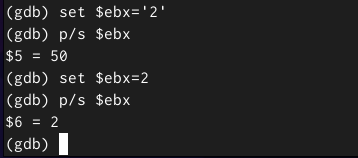{#fig:021 width=70%}

Завершаем работу файлов и выходим (рис. [-@fig:022]).

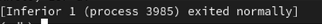{#fig:022 width=70%}

Скопируем файл lab8-2.asm, созданный при выполнении лабораторной работы №8,
с программой выводящей на экран аргументы командной строки (Листинг 8.2) в файл с
именем lab9-3.asm (рис. [-@fig:023]).

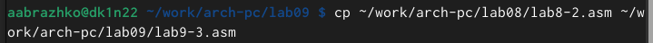{#fig:023 width=70%}

Запускаем файл в отладчике и указываем аргументы (рис. [-@fig:024]).

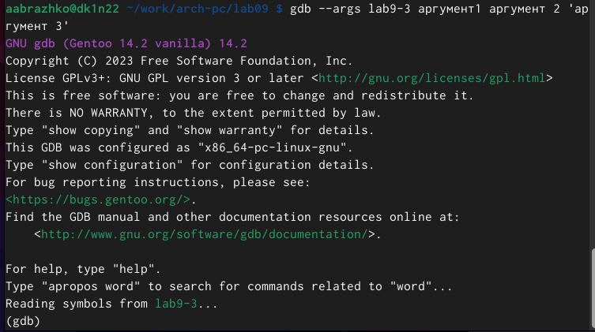{#fig:024 width=70%}

Установим точку останова перед первой инструкцией в программе и запустим её (рис. [-@fig:025]).

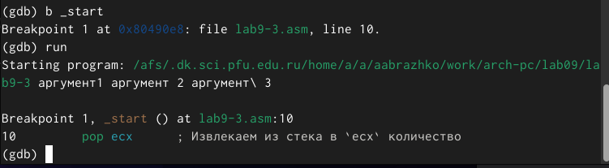{#fig:025 width=70%}

Проверим адрес вершины стека (рис. [-@fig:026]).

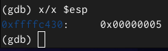{#fig:026 width=70%}

Просмотрим все позиции стека. По первому адрему хранится адрес, в остальных адресах хранятся элементы. Элементы расположены с интервалом в 4 единицы, так как стек может хранить до 4 байт, и для того чтобы данные сохранялись нормально и без помех, компьютер использует новый стек для новой информации. (рис. [-@fig:027]).

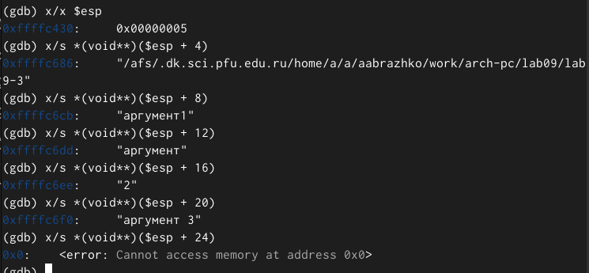{#fig:027 width=70%}

# Выполнение самостоятельной работы

Преобразуем программу из лабораторной работы №8 (Задание №1 для самостоятельной работы), реализовав вычисление значения функции 𝑓(𝑥) как подпрограмму. (рис. [-@fig:028]).

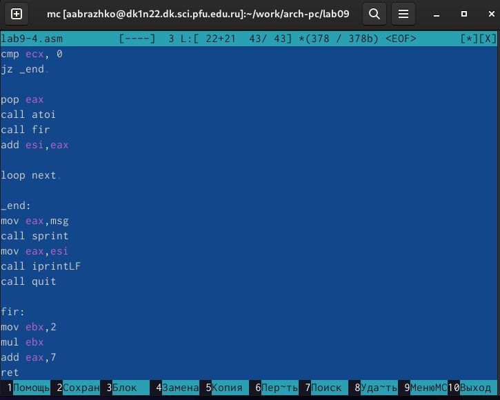{#fig:028 width=70%}

Создаём исполняемый файл и проверяем его работу (рис. [-@fig:029]).

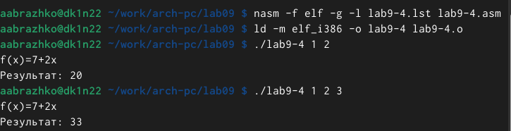{#fig:029 width=70%}

Переписываем программу из листинга 9.3 (рис. [-@fig:030]).

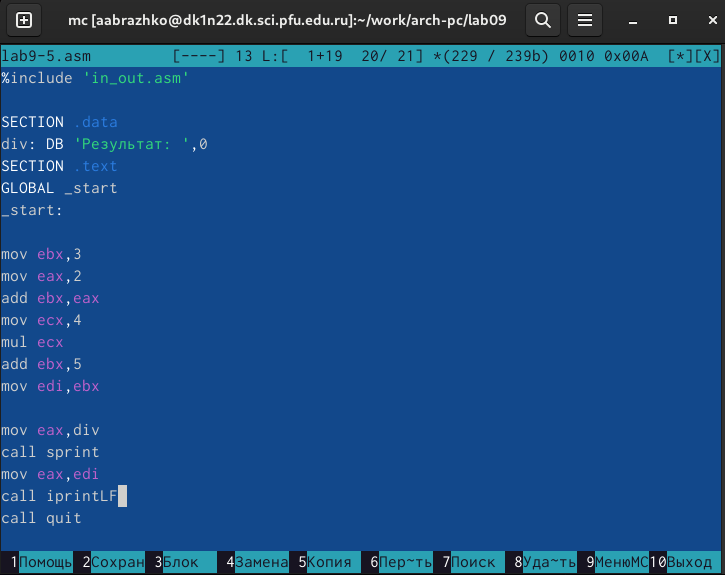{#fig:030 width=70%}

Создаём исполняемый файл и проверяем его работу. Программа должна вывести 10, что является ошибкой, так как должно быть 25 (рис. [-@fig:031]).

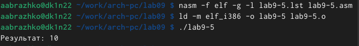{#fig:031 width=70%}

# Выводы

Я приобрела навыки написания программ с использованием подпрограмм. Познакомилась с методами отладки при помощи GDB и его основными возможностями.

# Список литературы{.unnumbered}

::: {#refs}
:::
