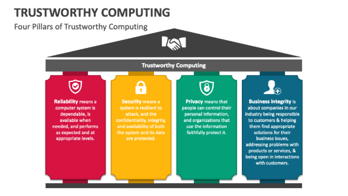
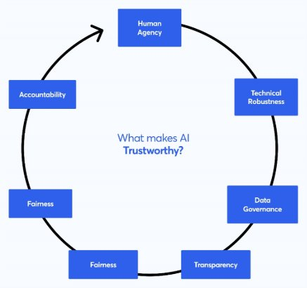
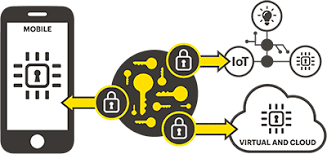

---
## Front matter
title: "Доклад на тему «Trustworthy Computing Initiative»"
subtitle: "Дисциплина: Операционные системы"
author: "Бражко Александра Александровна"

## Generic otions
lang: ru-RU
toc-title: "Содержание"

## Bibliography
bibliography: bib/cite.bib
csl: pandoc/csl/gost-r-7-0-5-2008-numeric.csl

## Pdf output format
toc: true # Table of contents
toc-depth: 2
lof: true # List of figures
lot: true # List of tables
fontsize: 12pt
linestretch: 1.5
papersize: a4
documentclass: scrreprt
## I18n polyglossia
polyglossia-lang:
  name: russian
  options:
	- spelling=modern
	- babelshorthands=true
polyglossia-otherlangs:
  name: english
## I18n babel
babel-lang: russian
babel-otherlangs: english
## Fonts
mainfont: IBM Plex Serif
romanfont: IBM Plex Serif
sansfont: IBM Plex Sans
monofont: IBM Plex Mono
mathfont: STIX Two Math
mainfontoptions: Ligatures=Common,Ligatures=TeX,Scale=0.94
romanfontoptions: Ligatures=Common,Ligatures=TeX,Scale=0.94
sansfontoptions: Ligatures=Common,Ligatures=TeX,Scale=MatchLowercase,Scale=0.94
monofontoptions: Scale=MatchLowercase,Scale=0.94,FakeStretch=0.9
mathfontoptions:
## Biblatex
biblatex: true
biblio-style: "gost-numeric"
biblatexoptions:
  - parentracker=true
  - backend=biber
  - hyperref=auto
  - language=auto
  - autolang=other*
  - citestyle=gost-numeric
## Pandoc-crossref LaTeX customization
figureTitle: "Рис."
tableTitle: "Таблица"
listingTitle: "Листинг"
lofTitle: "Список иллюстраций"
lotTitle: "Список таблиц"
lolTitle: "Листинги"
## Misc options
indent: true
header-includes:
  - \usepackage{indentfirst}
  - \usepackage{float} # keep figures where there are in the text
  - \floatplacement{figure}{H} # keep figures where there are in the text
---
# Введение

В начале 2000-х гoдов компания Microsoft столкнулась с серьезными вызовами в области безопасности, приватности и надежности своих продуктов. Широкое распространение вредоносного ПО, уязвимости в операционных системах и растущая критика со стороны пользователей и экспертов побудили компанию к принятию кардинальных мер.

В 2002 году Билл Гейтс объявил о запуске Trustworthy Computing Initiative (TWC), ставшей одним из наиболее значимых шагов в истории Microsoft. Значение и влияние TWC охватывают не только Microsoft, но и юридические и экономические аспекты, а также "человеческий фактор". [1]

Целью данного доклада является анализ инициативы Trustworthy Computing, ее основных принципов, реaлизованных стратегий, достигнутых результатов и ее влияния на индустрию информационных технологий.

# Основная часть
# Основные принципы TWC

Билл Гейтс обозначил четыре ключевых столпа инициативы TWC (рис. [-@fig:001]).

Надежность (Reliability): Обеспечение стабильности, предсказуемости и доступности программного обеспечения. Это включает в себя улучшение качества кода, повышeние устойчивости к ошибкам и предоставление средств для восстановления после сбоев.

Безопасность (Security): Защита систем и дaнных от несанкционированного доступа, использования, раскрытия, нарушения, изменения или уничтожения. Это включает в себя как защиту от внешних угроз (хакеры, вирyсы), так и защиту от внутренних ошибок в программном коде.

Конфиденциальность (Privacy): Предоставление пользователям контроля над их личными данными и прозрачность в отношении того, как эти данные собираются, используются и передаются. Microsoft обязуется соблюдать правила конфиденциальности и предоставлять пользователям инструменты для управления их данными.

Деловая этика (Business Integrity): Следование этическим принципам и бизнес-практикам при разработке, продаже и поддержке прогрaммного обеспечения. Это включает в себя честность, прозрачность и ответственность перед пользователями. [2]

{ #fig:001 width=70%, height=70% }

# Реализованные стратегии

Для рeализации принципов TWC, Microsoft предприняла ряд стратегических шагов (рис. [-@fig:002]):

Переобучение разработчиков. Был организован масштабный процесс обучения и переквалификации разработчиков, чтобы они уделяли больше внимания безопасности и качеству кода. Внедрены практики безопасной разработки (Secure Development Lifecycle - SDL).

Аудит кода и обнаружение уязвимостей. Существенно увеличены инвестиции в инструменты и методы для автоматичeского и ручного аудита кода с целью обнаружения уязвимостей на ранних стадиях разработки. Использовались методы статического и динамического анализа кода.

Сотрудничество с сообществом. Компания Microsoft начала более активно сотрудничать с экспертами по безопасности, исследовательскими организациями и хакерами-этиками (white hat hackers) для выявлeния и устранения уязвимостей. Были организованы программы Bug Bounty для стимулирования обнаружения уязвимостей.

Интеграция безопасности в продукты. Безопасность стала рассматриваться как неотъемлемая часть продукта, а не как дополнение. В Windows были внедрeны новые функции безопасности, такие как Firewall, User Account Control (UAC) и Data Execution Prevention (DEP).

Улучшение процeсса выпуска обновлений. Разработана более эффективная система распространения патчей и обновлений безопасности (Windows Update), чтобы оперативно устранять обнаруженные уязвимости.

Создание спeциализированных команд. Созданы специальные команды, ответственные за безопасность и конфиденциальность на всех этапах разработки. [3]

{ #fig:002 width=70%, height=70% }

# Достигнутые результаты

Благодаря TWC продукты компании Microsoft значительно улучшились в сферах безопасности, надежности и конфиденциальности (рис. [-@fig:003]).

Заметно снизилось количество и серьезность обнаруженных уязвимостей в программном обеспечении Microsoft. Внедрение практик SDL привело к улучшению качества кода и снижению количества ошибок. Windows стала гораздо более безопасной операционной системой, чем это было до TWC. Инициатива помогла восстановить и укрепить доверие пользователей к продуктам Microsoft. Активное сотрудничество с сообществом и разработка инструментов для анализа безопасности способствовали созданию более безопасной экосистемы для всех пользователей Windows.

{ #fig:003 width=70%, height=70% }

# Влияние на индустрию информационных технологий

TWC оказала большое влияние на всю индустрию информационных технологий (рис. [-@fig:004]).

Инициатива привлекла внимание к важности безопасности и конфиденциальности в разработке программного обеспечения, что побудило другие компании инвестировать в эти области. Многие компании начали внедрять практики безопасной разработки, аналогичные SDL, чтобы повысить безопасность своего программного обеспечения. TWC стимулировала развитие индустрии безопасности, включая разработку новых инструментов и методов для анализа и защиты программного обеспечения. Более того распространилось влияние на область конфиденциальности, заставив компании более внимательно относиться к защите личных данных пользователей. Многие практики, разработанные в рамках TWC, стали де-факто стандартами в индустрии.

{ #fig:004 width=70%, height=70% }

# Заключение

Trustworthy Computing Initiative была важным шагом в развитии индустрии информационных технологий. Она заставила Microsoft пересмотреть свои подходы к разработке программного обеспечения и уделять больше внимания безопасности, конфиденциальности и надежности. Хотя TWC не была безупречной, она оказала значительное положительное влияние на безопасность и качество программного обеспечения Microsoft и способствовала повышению осведомленности о безопасности во всей индустрии. Она стала важным прецедентом и оказала влияние на развитие практик безопасной разработки по всему миру.

# Список литературы{.unnumbered}

::: {#refs}
[1] Взгляд Microsoft на построение защищённых систем [Электронный ресурс]. 2005. URL: https://fcenter.ru/online/hardarticles/os/12461-Vzglyad_Microsoft_na_postroenie_zaschischennyh_sistem?ysclid=m8fq1wqwl6365745546.
[2] 10 years of Microsoft’s Trustworthy Computing Initiative [Электронный ресурс]. 2012. URL: https://www.helpnetsecurity.com/2012/01/13/10-years-of-microsofts-trustworthy-computing-initiative/
[3] Celebrating 20 Years of Trustworthy Computing [Электронный ресурс]. 2022. URL: https://www.microsoft.com/en-us/security/blog/2022/01/21/celebrating-20-years-of-trustworthy-computing/.
:::
